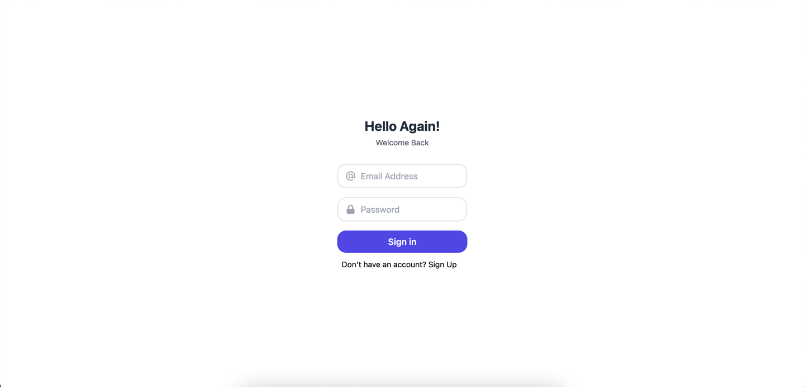
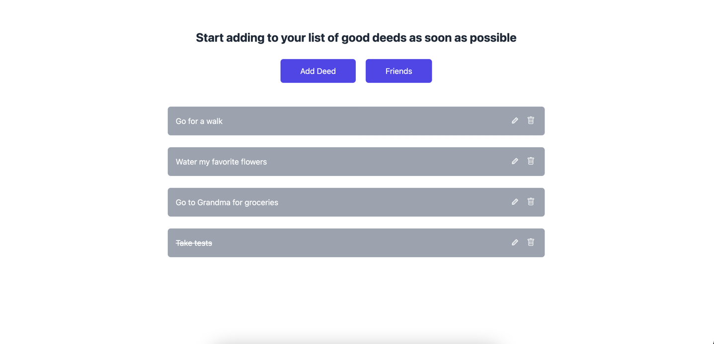
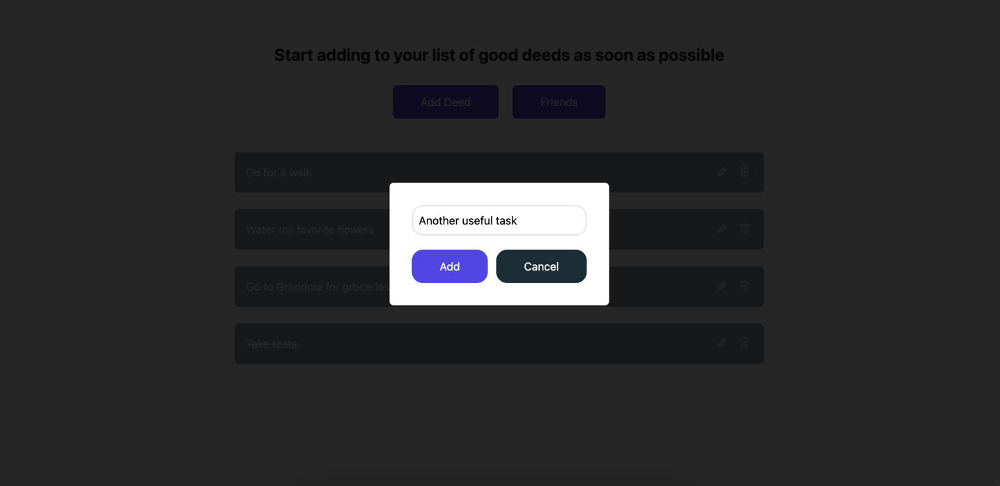
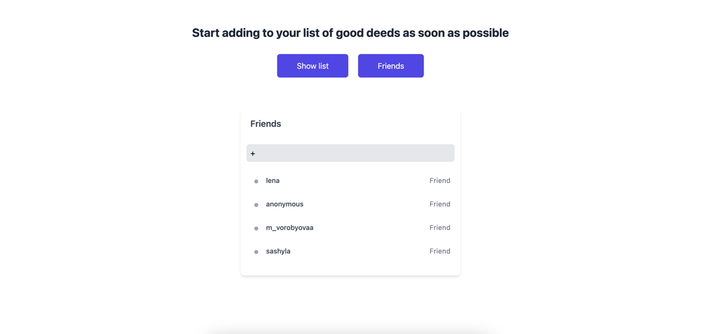
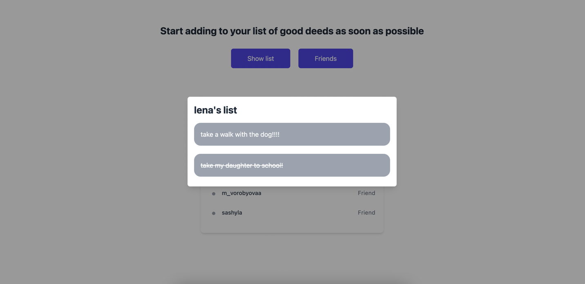

# list-of-deeds

**Technology stack:** TypeScript, NestJS, MongoDB, Docker, React, NextJS, Redux, Tailwind.

**Deployment Link:** https://client-ebon-ten.vercel.app/

*Due to the fact that the client, server and database are on different services, requests are not processed as fast as I would like :(*

## Description:

Within the framework of this project, an application for keeping to-do lists (good deeds) was implemented. Immediately the user gets to the registration / login page.
After confirming his identity, he gets to the main page, where he can add, delete and edit his cases, and he can also mark them as completed (when clicking on them).

The user also has access to functions for interacting with other registered users, namely:

- search for users,
- adding them as friends,
- view their to-do lists.

## Experience gained:

A client-server application for keeping to-do lists written in TypeScript was implemented. Docker containers were also assembled and a deployment was implemented as part of the project.

For the first time I worked with Next JS, MongoDB and Tailwind.

When implementing authentication and authorization, middleware Passport was added.js, JWT was used for data transmission.
To validate the data on the server side, ValidationPipe was used, which are built into NestJS. The interaction of the server part with the database is carried out using ORM Mongoose.

## Описание:

В рамках этого проекта было реализовано приложение для ведения списков дел (добрых дел). Сразу пользователь попадает на страницу регистрации/входа в систему. 
После подтверждения личности он попадает на главную страницу, где может добавлять, удалять и редактировать свои дела, также он может помечать их как выполненные (при клике на них).

Также пользователю доступны функции по взаимодействию с другими зарегистрированными пользователями, а именно: 

- поиск пользователей,
- добавление их в друзья,
- просмотр их списков дел.

## Полученный опыт:

Было реализовано клиент-серверное приложение по ведению списков дел, написанное на TypeScript. Также в рамках проекта были собраны docker-контейнеры и реализован деплой.

В первый раз поработала с NextJS, MongoDB и Tailwind. 

При реализации аутентификации и авторизации было добавлено middleware Passport.js, для передачи данных использовался JWT.
Для валидации данных на стороне сервера были использованы ValidationPipe, которые встроенны в NestJS. Взаимодействие серверной части с БД осуществляется с помощью ORM Mongoose.

